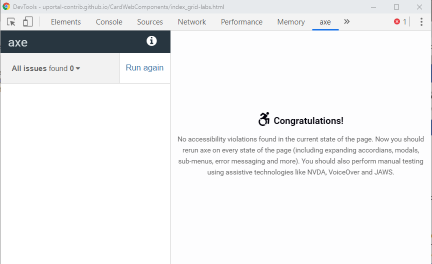
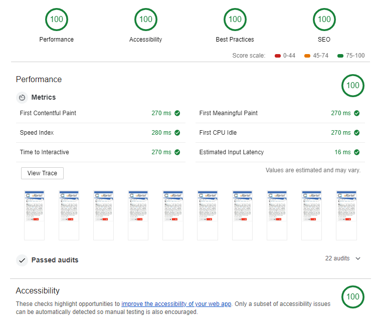
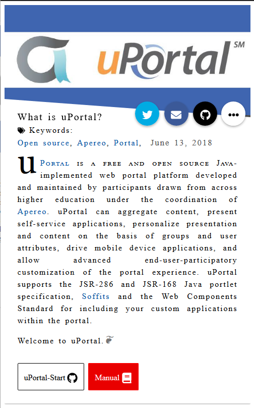

# Card Web Components

Card component for the uPortal ecosystem.

This component aims to display an Internationalized and accessible Card in Apereo uPortal.
So far tested in FF, Chrome, Safari and Edge (Windows, Mac, Linux, IOS & Android)

## Dependancies

Low and very light (-3Kb) dependencies make the component fast and easy to maintain.

- hyperHTML @lastest
- webcomponents-lite 1.2.0
- @fortawesome/fontawesome-free 5.5.0 (svg only)

## License

Apache-2.0

## Supported Languages

- `en-US` (default). :eyes: See it in [English (United States)](https://uportal-contrib.github.io/CardWebComponents/index.html) :us:
- `fr-FR` . :eyes: See it in [French](https://uportal-contrib.github.io/CardWebComponents/index_fr-FR.html) :fr:
- `fr-CA` . :eyes: See it in [French (Canada)](https://uportal-contrib.github.io/CardWebComponents/index_fr-CA.html)
- `es-ES` . :eyes: See it in [Spanish](https://uportal-contrib.github.io/CardWebComponents/index_es.html) :es:
- `nl-NL` . :eyes: See it in [Dutch](https://uportal-contrib.github.io/CardWebComponents/index_nl.html)
- `it` . :eyes: See it in [Italian](https://uportal-contrib.github.io/CardWebComponents/index_it.html) :it:
- `ar` . :eyes: See it in [Standard Arabic](https://uportal-contrib.github.io/CardWebComponents/index_ar.html)
- `de` . :eyes: See it in [German](https://uportal-contrib.github.io/CardWebComponents/index_de.html) :de:
- `zn-CN` . :eyes: See it in [Simplified Chinese](https://uportal-contrib.github.io/CardWebComponents/index_zn-CN.html) :cn:


## See multiple components in Flexbox and Grid layouts

- `Flexbox layout` :eyes: See it in [flexbox layout](https://uportal-contrib.github.io/CardWebComponents/index_albatros.html)
- `Grid layout` . :eyes: See it in [a grid layout](https://uportal-contrib.github.io/CardWebComponents/index_grid-labs.html)

Many Thanks to Heydonworks and Jen Simmons fantastic works
in these page, axe-core latest Audit score are excellent and are conforme to WCAG 2.1 AAA



## Features

- [x] WCAG 2.1 Level AA - Level AAA Work in progress to got beyond simple conformance, but effective Inclusivity,
- [x] extra Features in CSS Level 4 : :visible-focus (enable accessibility flags)
- [x] An user can differentiate french from France and French Canadian with Speech Assistive Technologies (falsy-friends, Cutural Differences)
  - [ ] add Support for `en-GB`
  - [ ] add Support for `fr-BE`
  - [ ] add Support for `fr-CH`
  - [ ] add Support for `nl-BE`
  - [ ] add Support for Gaelic (Scotland) `gd`
  - [ ] add Support for Welsh `cy`

## Audits



## Build

- use `npm install` to get dependencies.
- use `npm start` to view code in a local web server.
- use `npm test` to run lint checks

## Screenshots



updated: 2019/05/31

## How it works

- open `dist/index.html` and change `<html lang="en-US">` to `<html lang="fr-FR">`, the component will be in french.
- In uPortal, the component will change automatically according to the user's locales switcher.

## Running in uPortal

copy all the files from `dist/` folder in a `card/` directory, then copy this folder into
`uPortal-start/overlays/uPortal/src/main/webapp` (or other location served by Tomcat).

#### Sample HTML in uPortal 4.2 to 5.2

Define a SimpleCMS portlet with HTML content like the following:

```HTML
<my-card id="what-is-uportal-i18n" messagesPath="../../../../uPortal/card/" cssPath="../../../../uPortal/card/css"></my-card>
<script src='https://cdnjs.cloudflare.com/ajax/libs/webcomponentsjs/1.2.0/webcomponents-lite.js' defer></script>
<script src='https://unpkg.com/regenerator-runtime@0.12.1/runtime.js' defer></script>
<script src="../../../../uPortal/card/my-card.umd.js" defer></script>
```

#### Sample HTML in uPortal 5.3

Define a SimpleCMS portlet with HTML content like the following:

```HTML
<my-card id="what-is-uportal-i18n" messagesPath="../../../../uPortal/card/" cssPath="../../../../uPortal/card/css"></my-card><script src="../../../../uPortal/card/my-card.umd.js" defer></script>
```
