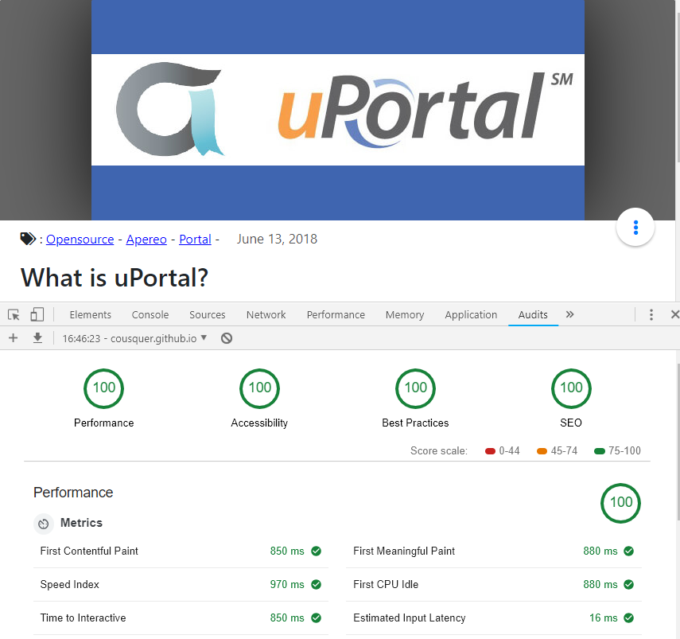

# Card Web Components

Card component for the uPortal ecosystem (POC).

This component aims to display an Internationalized and accessible Card in Apereo uPortal.
So far tested in FF, Chrome, Safari and Edge (Windows, Mac, Linux, IOS & Android)

## Dependancies

Low and very light (-3Kb) dependencies make the component fast and easy to maintain.

- hyperHTML @lastest
- webcomponents-lite 1.2.0
- Bootstrap 4.1.1

## Supported Languages

- en-US (default)
- fr-FR
- es-ES
- nl-NL


## Features

- [x] WCAG 2.1 Level AA - Level AAA
- [x] extra Features in CSS Level 4 : :visible-focus (enable accessibility flags)

## Audits



## Build

- use `npm install` to get dependencies.
- use `npm start` to view code in a local web server.
- use `npm test` to run lint checks

## Screenshots


## How it works

open `index.html` and change `<html lang="en-US">` to `<html lang="fr-FR">`, the component will be in french.

In uPortal, the component will change automatically according to the user's locales switcher.

## Running in uPortal

copy all the files from `dist/` folder in a `card/` directory, then copy this folder into
`uPortal-start/overlays/uPortal/src/main/webapp` (or other location served by Tomcat).

#### Sample HTML

Define a SimpleCMS portlet with HTML content like the following:

```HTML
<link rel="stylesheet" href="https://use.fontawesome.com/releases/v5.5.0/css/all.css" integrity="sha384-B4dIYHKNBt8Bc12p+WXckhzcICo0wtJAoU8YZTY5qE0Id1GSseTk6S+L3BlXeVIU" crossorigin="anonymous">
<my-card id="what-is-uportal-i18n" messagesPath="../../../../uPortal/card/" cssPath="../../../../uPortal/card/css"></my-card>
<script src='https://cdnjs.cloudflare.com/ajax/libs/webcomponentsjs/1.2.0/webcomponents-lite.js' defer></script>
<script src='https://unpkg.com/regenerator-runtime@0.12.1/runtime.js' defer></script>
<script src="../../../../uPortal/card/my-card.umd.js" defer></script>
```
